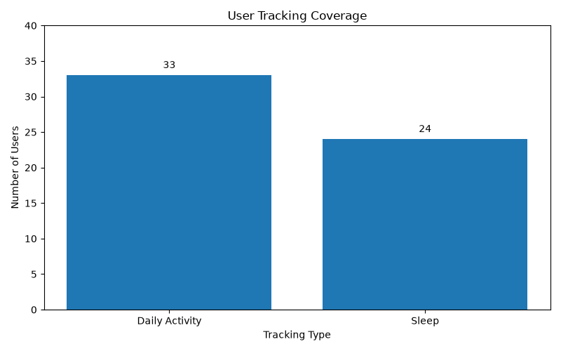
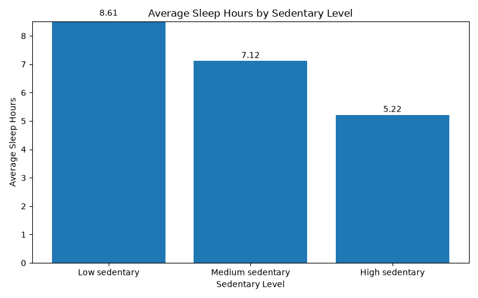
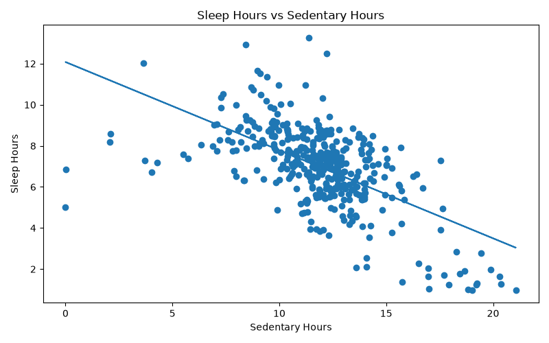

# Bellabeat Case Study Summary Report

## Project Overview

This project analyzes Fitbit smart device data to understand user activity, sleep behavior, and sedentary time.

The goal is to find useful patterns and provide business recommendations for Bellabeat.

## Business Task

Bellabeat wants to understand how users track their daily activity and sleep.

The main business question is:

How can Bellabeat use smart device data to help users build healthier daily habits?

## Tools Used

- Python
- pandas
- SQLite
- SQL
- matplotlib
- Jupyter Notebook
- GitHub

## Data Summary

The analysis used two cleaned datasets:

- Daily activity data
- Sleep data

The daily activity dataset included 33 users.

The sleep dataset included 24 users.

Both datasets covered the same period:

2016-04-12 to 2016-05-12

## Main Findings

### 1. Sleep tracking had lower user coverage

The daily activity dataset included 33 users.

The sleep dataset included 24 users.

This means that not all users who tracked daily activity also tracked sleep.

### 2. Higher sedentary levels were associated with lower sleep duration

Average sleep hours decreased as sedentary level increased.

- Low sedentary: 8.61 average sleep hours
- Medium sedentary: 7.12 average sleep hours
- High sedentary: 5.22 average sleep hours

### 3. Sedentary time had a negative relationship with sleep duration

The correlation between sedentary hours and sleep hours was -0.60.

This suggests a moderate negative relationship.

As sedentary hours increased, sleep hours tended to decrease.

## Recommendations

### 1. Encourage more consistent sleep tracking

Bellabeat could remind users to track sleep more consistently.

This could be done through app reminders, onboarding messages, or sleep habit notifications.

### 2. Use sedentary-time alerts

Bellabeat could send movement reminders when users spend too much time sedentary.

This could help users reduce long inactive periods during the day.

### 3. Connect activity and sleep insights

Bellabeat could combine activity, sedentary time, and sleep data in the app.

For example, the app could show users how their sedentary behavior may relate to their sleep duration.

## Limitations

This analysis has some limitations.

The dataset is small.

The data covers only one month.

The data comes from Fitbit users, not Bellabeat users.

The analysis shows patterns, but it does not prove causation.

Because of this, the recommendations should be used as directional insights.

## Final Conclusion

The analysis showed that sleep tracking had lower user coverage than daily activity tracking.

It also showed that higher sedentary time was related to lower sleep duration.

Based on these findings, Bellabeat could improve the app by encouraging sleep tracking, sending movement reminders, and helping users understand how daily activity and sedentary behavior relate to sleep.
